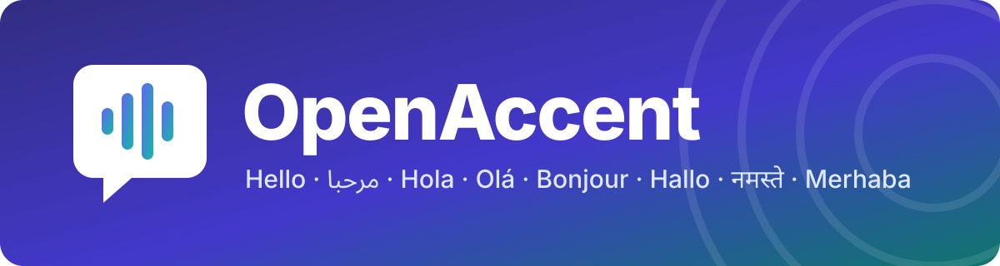
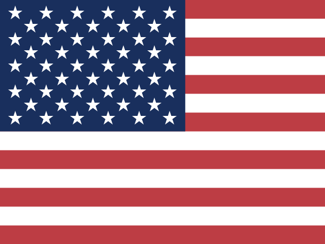
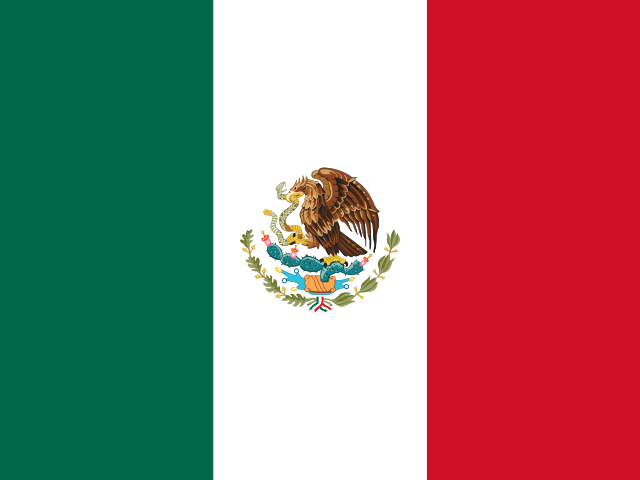
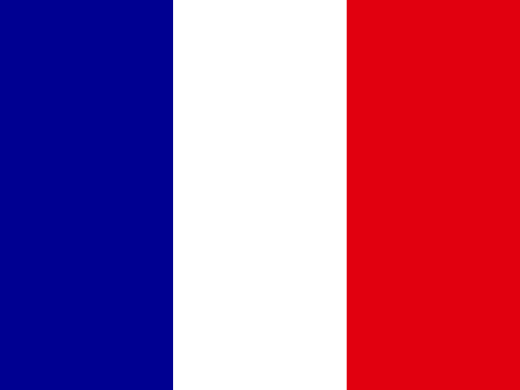
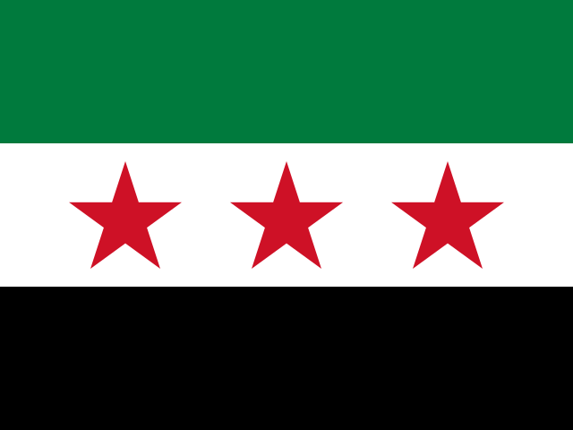
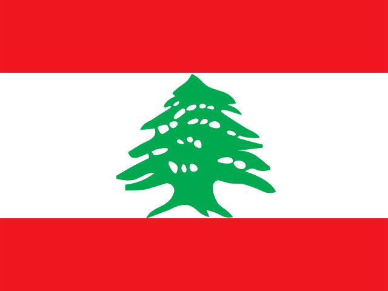
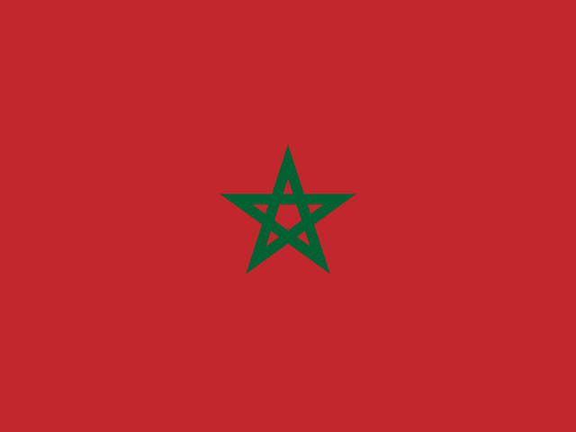

  

<b>Fale com a IA como você falaria com alguém da sua terra.</b>

  
  
  
  
  

  
  
  
  
  
  
  
  

> 🤖 Esta tradução foi rascunhada por uma IA. Se o português é a sua língua, ajude a melhorá-la — é exatamente o tipo de coisa que este projeto quer consertar.

OpenAccent é um dicionário de código aberto dos dialetos do mundo, organizado por país, construído pela comunidade e verificado por falantes nativos. Ele também guarda uma memória pessoal de como *você* fala. Os dois chegam a assistentes de IA como o Claude via [MCP](https://modelcontextprotocol.io).

> **Status: desenvolvimento inicial.** O servidor MCP funciona localmente, e os primeiros 14 dialetos estão sendo preenchidos com fontes abertas. Ainda não há versão para instalar.

## O problema

Modelos de IA são ruins com dialetos:

- **Misturam dialetos** na mesma resposta.
- **Mudam** de palavras e de dialeto no meio da conversa.
- **Inventam palavras** ou usam termos raros que ninguém fala.
- **Esquecem suas correções** na conversa seguinte.

Nunca parece uma conversa com uma pessoa de verdade da sua terra.

## Como o OpenAccent resolve

| Parte | O que faz |
|---|---|
| 📖 **Dicionário** | Uma pasta por país e por dialeto, um arquivo por palavra. Cada palavra cita a fonte, e nada é marcado como *verificado* até um falante nativo aprovar. |
| 🧭 **Guias de dialeto** | Como cada dialeto soa e funciona, e os erros que a IA costuma cometer nele. |
| 🧠 **Memória pessoal** | Seu dialeto, suas palavras, suas correções. Fica no seu computador, e suas correções valem mais que o dicionário. |
| 🔍 **Checagem de resposta** | Aponta palavras do dialeto errado, palavras raras, palavras escritas como se pronunciam e palavras que você já corrigiu. |

## Primeira leva: 14 dialetos

<table>
  <tr><td align="center" width="20%"> <b>Inglês americano</b></td><td align="center" width="20%"> <b>britânico</b></td><td align="center" width="20%"> <b>indiano</b></td><td align="center" width="20%"> <b>espanhol do México</b></td><td align="center" width="20%"> <b>da Espanha</b></td></tr>
  <tr><td align="center" width="20%"> <b>português do Brasil</b></td><td align="center" width="20%"> <b>francês da França</b></td><td align="center" width="20%"> <b>alemão da Alemanha</b></td><td align="center" width="20%"> <b>turco</b></td><td align="center" width="20%"> <b>híndi</b></td></tr>
  <tr><td align="center" width="20%"> <b>árabe egípcio</b></td><td align="center" width="20%"> <b>saudita</b></td><td align="center" width="20%"> <b>sírio</b></td><td align="center" width="20%"> <b>libanês</b></td><td align="center" width="20%"> <b>darija marroquino</b></td></tr>
</table>

As palavras vêm do [Wiktionary](https://en.wiktionary.org) (CC BY-SA 4.0), filtradas por região e ordenadas por frequência. Toda palavra importada começa como **rascunho** até um falante nativo revisar.

## Contribua

Não precisa programar.

- **Fala um desses dialetos?** O que mais precisamos são **revisores**. Abra uma issue e conte qual você fala.
- **Quer adicionar uma palavra ou um dialeto?** Formulários simples vêm aí. Por enquanto, veja [`data/README.md`](../../data/README.md).
- **Consegue melhorar esta tradução?** Por favor!

## Licença

- **Código:** [MIT](../../LICENSE)
- **Dados do dicionário** (`data/`): [CC BY-SA 4.0](../../data/LICENSE), a mesma licença da Wikipédia. Os dados ficam abertos para sempre.
